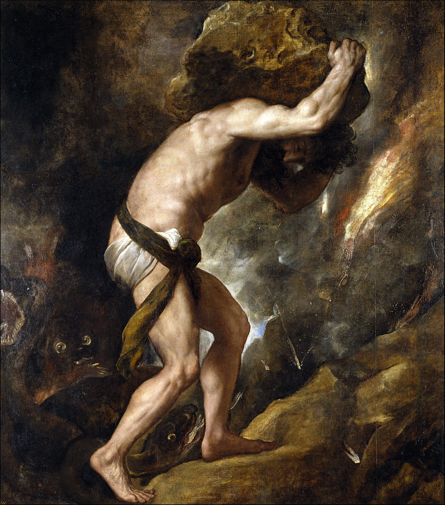

It's not unfair to say that this last year has broken me.
My unhealthy relationship with writing, coupled with a PhD that feels disjointed, incomplete, and often embarrassing, has made finishing my thesis feel impossible.
The challenge is neither scientific nor technical — it's emotional.
I've spent the vast majority of my waking hours not working on my thesis, but procrastinating on it.
It's become an excuse I use to put off hobbies, learning, job hunting, and socializing.
I've been stuck in a sort of stasis, my whole life on pause, and have done remarkably little to save myself.
(Un)fortunately, I'm out of time for this emotional avoidance.

I have half of a software chapter to finish, an introduction to write, and a small bioinformatics chapter to fit in the middle.
I have until the 28th of October to do so.
My thesis feels less than halfway done, but I'm about nine-tenths of the way through my writing time.
That's horrifying.
After the 28th, I'll have plenty of time for reflection, repair, and growth, but, clearly, something needs to be done now.

## Doing Something Now

It's been clear for some time that I require an external source of motivation and accountability in order to complete any sufficiently large project.
As much as I wish I could reach deep inside myself and find the drive I'd need to commit to a project for months or years, it's not something I've figured out yet.
In the meantime, this blog post, which I will share with my friends, family, and PhD supervisor, can hopefully serve as a source of extrinsic accountability.

To that end, I'll update this page every day (from now until the 28th of October), documenting:
1. The number of hours I slept
2. The amount of time I spent working on my thesis
3. The number of thesis-words written (or figures finished)

I'm aiming for 8 hours and 20 minutes of sleep each day, and 7–8 hours of thesis work.
I don't yet know how that time will translate into tangible progress, so that's why I'm also tracking words written.
In addition to these metrics, I'll aim to include a brief bit of reflection each day, documenting what went well, what didn't, and what I'll try to do better tomorrow.
Periodically, I'll use that space to evaluate how my thesis is progressing overall, adjusting my plans as needed to ensure I stay on track for submission. It's by writing a little bit here that I'll hold myself accountable to writing a lot more there.

## Daily Updates
#### September 13th (45 Days Remaining)
- **Sleep ::** 10 hours and 28 minutes
- **Focused Time ::** 1 hour and 27 minutes 
- **Progress ::** 41 words in outline, 406 in final draft — no figures

Started very late, after 18:30, but still got something done.
Aiming for a full day (with an 08:30 start) tomorrow.
Finishing the full PGLang & SMILES section should be within reach.

#### September 14th (44 Days Remaining)
- **Sleep ::** 5 hours and 46 minutes
- **Focused Time ::** 7 hours and 7 minutes 
- **Progress ::** 1,381 words in final draft — no figures

Struggled to get to sleep — turns out it's hard to turn around a sleep schedule in a day...
Managed a full day (7+ hours) for the first time in recent memory.
Finished the PGLang & SMILES section.
That's a major one out of the way!
I have a couple of short, easy sections ahead of me; I'd like to start and finish at least one tomorrow!
Unfortunately, I ended up working a bit late today...
A quicker start tomorrow (and saving dinner for after I finish working) should leave me with some more time to unwind in the evening.

#### September 15th (43 Days Remaining)
- **Sleep ::** 9 hours and 8 minutes
- **Focused Time ::** 6 hours and 34 minutes 
- **Progress ::** 255 words in outline, 526 in final draft — no figures

Slept much better, but had a more distracted day.
Got sidetracked for several hours (by chores around the house) after coming home for lunch.
I also felt like I was getting stuck more on wording today...
Lots of re-writing.
I tried to make up for lost time by working late (until 22:04), but I didn't quite finish the mass calculation section.
To finish it tomorrow, I just have to take some screenshots and convert those 255 words of outline into more-polished prose.
Tomorrow I'll try working from home in the morning, then I'll head to the library in the afternoon.
That might help me to stay focused even as my energy wanes.

