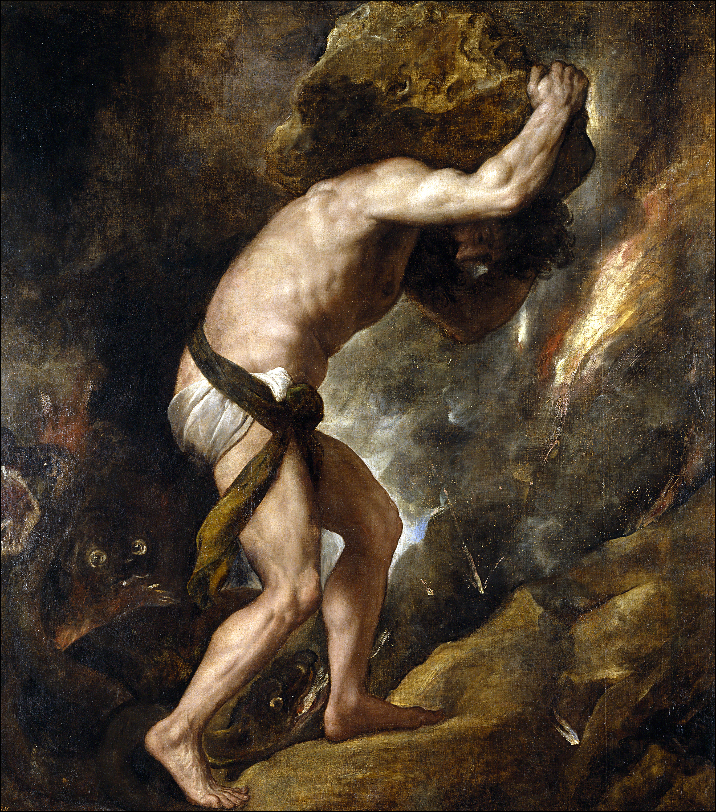

It's not unfair to say that this last year has broken me.
My unhealthy relationship with writing, coupled with a PhD that feels disjointed, incomplete, and often embarrassing, has made finishing my thesis feel impossible.
The challenge is neither scientific nor technical — it's emotional.
I've spent the vast majority of my waking hours not working on my thesis, but procrastinating on it.
It's become an excuse I use to put off hobbies, learning, job hunting, and socializing.
I've been stuck in a sort of stasis, my whole life on pause, and have done remarkably little to save myself.
(Un)fortunately, I'm out of time for this emotional avoidance.

I have half of a software chapter to finish, an introduction to write, and a small bioinformatics chapter to fit in the middle.
I have until the 28th of October to do so.
My thesis feels less than halfway done, but I'm about nine-tenths of the way through my writing time.
That's horrifying.
After the 28th, I'll have plenty of time for reflection, repair, and growth, but, clearly, something needs to be done now.

## Doing Something Now

It's been clear for some time that I require an external source of motivation and accountability in order to complete any sufficiently large project.
As much as I wish I could reach deep inside myself and find the drive I'd need to commit to a project for months or years, it's not something I've figured out yet.
In the meantime, this blog post, which I will share with my friends, family, and PhD supervisor, can hopefully serve as a source of extrinsic accountability.

To that end, I'll update this page every day (from now until the 28th of October), documenting:
1. The number of hours I slept
2. The amount of time I spent working on my thesis
3. The number of thesis-words written (or figures finished)

I'm aiming for 8 hours and 20 minutes of sleep each day, and 7–8 hours of thesis work.
I don't yet know how that time will translate into tangible progress, so that's why I'm also tracking words written.
In addition to these metrics, I'll aim to include a brief bit of reflection each day, documenting what went well, what didn't, and what I'll try to do better tomorrow.
Periodically, I'll use that space to evaluate how my thesis is progressing overall, adjusting my plans as needed to ensure I stay on track for submission. It's by writing a little bit here that I'll hold myself accountable to writing a lot more there.

## Daily Updates
#### September 13th (45 Days Remaining)
- **Sleep ::** 10 hours and 28 minutes
- **Focused Time ::** 1 hour and 27 minutes 
- **Progress ::** 41 words in outline, 406 in final draft — no figures

Started very late, after 18:30, but still got something done.
Aiming for a full day (with an 08:30 start) tomorrow.
Finishing the full PGLang & SMILES section should be within reach.

#### September 14th (44 Days Remaining)
- **Sleep ::** 5 hours and 46 minutes
- **Focused Time ::** 7 hours and 7 minutes 
- **Progress ::** 1,381 words in final draft — no figures

Struggled to get to sleep — turns out it's hard to turn around a sleep schedule in a day...
Managed a full day (7+ hours) for the first time in recent memory.
Finished the PGLang & SMILES section.
That's a major one out of the way!
I have a couple of short, easy sections ahead of me; I'd like to start and finish at least one tomorrow!
Unfortunately, I ended up working a bit late today...
A quicker start tomorrow (and saving dinner for after I finish working) should leave me with some more time to unwind in the evening.

#### September 15th (43 Days Remaining)
- **Sleep ::** 9 hours and 8 minutes
- **Focused Time ::** 6 hours and 34 minutes 
- **Progress ::** 255 words in outline, 526 in final draft — no figures

Slept much better, but had a more distracted day.
Got sidetracked for several hours (by chores around the house) after coming home for lunch.
I also felt like I was getting stuck more on wording today...
Lots of re-writing.
I tried to make up for lost time by working late (until 22:04), but I didn't quite finish the mass calculation section.
To finish it tomorrow, I just have to take some screenshots and convert those 255 words of outline into more-polished prose.
Tomorrow I'll try working from home in the morning, then I'll head to the library in the afternoon.
That might help me to stay focused even as my energy wanes.

#### September 16th (42 Days Remaining)
- **Sleep ::** 8 hours and 4 minutes
- **Focused Time ::** 5 hours and 19 minutes 
- **Progress ::** 733 words in outline, 412 in final draft — two simple figures

Hardest day yet...
That's a worrying trend.
Ended up working from home the entire day, and didn't get started until 10:30.
Unfortunately, I think the only way to manage 7 focused hours in a day is to spend it entirely at the library — lunch is just something I'll have to figure out...
I finished the mass calculation section, and made some outline progress on the fragment prediction section.
Unfortunately, outlining that has brought me back in contact with some of the worst (and most unfinished) code I've ever written.
Looking back at it was _deeply_ demoralizing.
Tomorrow will be a (mostly) off day, though I'll still try for 2.5 focused hours in the morning (at the library).

#### September 17th (41 Days Remaining) — Off Day
- **Sleep ::** 8 hours and 22 minutes
- **Focused Time ::** 2 hours and 40 minutes
- **Progress ::** ~634 words in outline — no figures

I didn't get up at 08:00 or do any work in the library, but I made some decent progress regardless.
For an off day, I'd consider it more than successful.
Time to recoup a little.
Tomorrow I _will_ be at the library all day (and will hopefully finish this fragmentation section).

#### September 18th (40 Days Remaining)
- **Sleep ::** 8 hours and 57 minutes
- **Focused Time ::** 7 hours and 6 minutes
- **Progress ::** 459 words in outline, 846 in final draft — half of a simple figure

When it rains, it pours, or whatever.
It seems like one of my cats is dying...
Needless to say, that interrupted my day a bit.
We're keeping an eye on her.
The morning before that was good and focused though.
I didn't finish the fragmentation section because I went on a multi-hour maths adventure, but I got what I wanted out of that, so that's good.
Got some equations in my thesis to really frighten the biologists with.
Tomorrow the library is closed in the morning, but I'll do my best to focus from home.
I'll head in for opening at 1 PM — I'm sure I'll need the boost!
I really need to wrap up this software chapter in the next week.
After that, it's onto the introduction, then the bioinformatics chapter, then the discussion.

#### September 19th (39 Days Remaining)
- **Sleep ::** 7 hours and 11 minutes
- **Focused Time ::** 22 minutes
- **Progress ::** ~58 words in final draft — no figures

My cat, Dyson, who was a fifteen-year-old, cow-patterned polydactyl, died today.
I don't believe in an afterlife — in the literal sense, at least — but everyone leaves a mark on those they knew.
I think it's through these impressions that the dead live on.
I'll remember Dyson for the joyful trills she'd give in greeting, her infatuation with the bathroom tap, and all of the kittens she never had.

I can't say I look forward to dying.
Tomorrow comes.

#### September 20th (38 Days Remaining)
- **Sleep ::** 9 hours and 25 minutes
- **Focused Time ::** 24 minutes
- **Progress ::** ~30 words in final draft — no figures

Our other cat (who never goes outside) ran outside this morning and was missing until late tonight when we finally found him.
I'm sick of the drama.
I'm sick of the trauma.
Back in the library tomorrow afternoon, aiming for 4–5 hours of work at a minimum...

#### September 21st (37 Days Remaining)
- **Sleep ::** 6 hours and 24 minutes
- **Focused Time ::** 1 hour and 13 minutes
- **Progress ::** ~244 words in final draft — finished simple figure

Didn't meet my goal today.
I got too slow of a start in the morning and didn't start working on my thesis until late this evening.
I'll get to the library around 09:00 tomorrow, then stay until my DMV appointment at 15:30.
Afterwards, I'll eat lunch then drive back to work more (until 18:30).
I've got to make up for a lot of lost time, so I'll aim to actually finish the fragmentation section tomorrow.
It would be nice to get halfway though the Publication 2 bookends as well.
Breaks remain important, but I might want to do a little bit of work after dinner too.
We'll see how burnt out I get.
Can it really get any worse?

#### September 22nd (36 Days Remaining)
- **Sleep ::** 9 hours and 13 minutes
- **Focused Time ::** 5 hours and 9 minutes
- **Progress ::** 254 words in outline, 663 in final draft — no figures

Got a late start today (I think I'm still catching up on sleep), and had a DMV appointment (that turned into some more errands afterwards), but I'm happy with how I used the time I had.
I ended up working until 20:00 in the end.
Unfortunately, I've still not finished the fragmentation section, and I think that will take me until at least (and hopefully, at most) tomorrow.
If it takes any longer, I'll need to start dropping content...

#### September 23rd (35 Days Remaining)
- **Sleep ::** 6 hours and 11 minutes
- **Focused Time ::** 0 minutes
- **Progress ::** No words, no figures

Just completely failed to do any thesis writing today.
No real good reason.
I stayed up too late playing video games with my brother, then slept in late, and spent the rest of the day proofreading a paper.
That was a lovely time, but afterwards I just never got back to work.
I've made my Windows unbootable to keep me away from video games, and I'm heading to bed now.
The plan is to be at the library from ~08:45 until they close at 20:00.
I can (legally) drive now, so I can get there quickly, pop out for lunch, and get home after dark.
I'd like this to be the last time I have to write something like this.

#### September 24th (34 Days Remaining)
- **Sleep ::** 8 hours and 57 minutes
- **Focused Time ::** 3 hours and 51 minutes
- **Progress ::** 618 words in final draft — no figures

It's something, but not as much as I would have liked.
I needed to spend nearly two hours helping a collaborator with some analysis for a paper, and about an hour fighting Three to cancel my phone plan.
Still, I could have done more in the evening, but I stopped working around 19:00.
I ended up sleeping in because I was struggling to fall asleep last night, but I'll try again tonight.
I'd like to (at least) cross the 7-hour line tomorrow.
Perhaps I stay away from email entirely — if anyone needs more from me, they can wait.

Every day, it gets a little easier.\
But you gotta do it every day.\
That's the hard part.\
But it does get easier.

#### September 25th (33 Days Remaining)
- **Sleep ::** 9 hours and 9 minutes
- **Focused Time ::** 7 hours and 13 minutes
- **Progress ::** 765 words in outline, 207 in final draft — half of a simple figure

Happy to be back on track.
I'm perhaps coming down with a cold (everyone else in my house has it), but I'm powering through.
I got sidetracked doing a bit of research about graph fragmentation algorithms today (since I had to write about it), but it was interesting, at least.
I'm embarrassed to admit I'm still working on the fragmentation section...
My goal tomorrow is to finish that and the Publication 2 bookends — however long it takes...

#### September 26th (32 Days Remaining)
- **Sleep ::** 7 hours and 53 minutes
- **Focused Time ::** 5 hours and 35 minutes
- **Progress ::** 125 words in outline, 874 in final draft — finished simple figure

Ideally, I would have slept and worked for a bit longer, but I'm just happy I finished that fragmentation section.
I might even be proud of it...
One pattern that's repeating is: working late, leads to sleeping late, leads to starting work late, then working late again.
It's a cycle I'm familiar with and that I'll need to break.
Tomorrow could be a good opportunity, as I'm planning to see a friend in the afternoon.
With that said, there's still work to do, so I'll aim for 3 hours and 20 minutes of focused work before then.
If that's not enough time to finish the bookends and start on the next section, I'll do a bit more.
Beyond that, my goal will be stopping work on time and getting to sleep early — it'll be a busy week!

#### September 27th (31 Days Remaining)
- **Sleep ::** 6 hours and 45 minutes
- **Focused Time ::** 5 hours and 7 minutes
- **Progress ::** 487 words in outline, 488 in final draft — no figures

I didn't end up going out today, but I did do some good work and finish those bookends, so I'm proud of that.
I'm heading to bed (mostly on time) now, and will be up early tomorrow to head to the library.
I'll aim for another 3 hours and 20 minutes of work (minimum) before heading to meet up with my friend I was supposed to see today.
One more section and I'll be done with the main chunk of the software chapter, leaving just the "related" and "ongoing" work sections.
I'll be honest, those sections aren't super small, and I'm a bit afraid of that, but all I can do is try.

#### September 28th (30 Days Remaining)
- **Sleep ::** 8 hours and 16 minutes
- **Focused Time ::** 3 hours and 44 minutes
- **Progress ::** 732 words in outline, 365 in final draft — no figures

I did actually end up going out today, and it was nice to see my friend!
It's left me feeling a little bit more human.
I'm also pretty pleased with the work I got done in the time allotted: I finished outlining the next section and wrote the final draft for half of it.
Tomorrow I'll aim for a full day (7+ hours) spent at the library.
I'm officially in my last month, which is very... unnerving.
I need to finish one software section per day at a minimum this week — otherwise I'll run out of time and have to move on to writing the introduction (leaving the software chapter unfinished).
Let's stay well-rested so I can stay hard-working.

#### September 29th (29 Days Remaining)
- **Sleep ::** 9 hours and 40 minutes
- **Focused Time ::** 5 hours and 14 minutes
- **Progress ::** 307 words in outline, 440 in final draft — outlined complex figure

I slept in in the morning, so I didn't quite get to my 7 hours, but I worked solidly until the end of the day.
I also got some good work done in the morning when I had a spare moment at home (before leaving for the library).
I think I'm getting a bit better at taking advantage of small free moments, instead of putting off starting until I have a large chunk of free time.
Keeping this brief so I can wake up early and hit that 7 hour target!
I need to finish the "Docking Consistency Score" section tomorrow and make a dent in the GLAM one.

I'll need a lot of therapy to forget about GLAM.

#### September 30th (28 Days Remaining) — Off Day
- **Sleep ::** 7 hours and 43 minutes
- **Focused Time ::** 0 hours and 0 minutes
- **Progress ::** 0 words in outline, 0 in final draft — no figures

No clear reason for why today was so bad, aside from the fact I didn't start my day with work or head to the library.
Without the strong start or good environment, I just never got started.
I'll count this as my "Off Day", and try to work solidly until next week.
Tomorrow, I'll make sure I'm at the library before 09:00!
I'll be helped with that by all the construction workers showing up at 08:00...

#### October 1st (27 Days Remaining)
- **Sleep ::** 5 hours and 26 minutes
- **Focused Time ::** 0 hours and 0 minutes
- **Progress ::** 0 words in outline, 0 in final draft — no figures

Okay, when I said "no clear reason", I think there was one: I installed my new GPU in my computer first thing in the morning instead of jumping into work.
From then on, the rest of my day was playing with that.
Afterwards, since I'd spent some irritating time trying to get a local LLM running, I procrastinated heading to bed.
I did that for so long, playing video games, that I didn't get to bed until ~07:30 this morning...
Obviously, I'm feeling pretty rough.
Tomorrow is the last weekday of this week, so it's the last day with full library hours.
I'll bike there in the morning, head home for lunch (for less than one hour), then drive back to work through the afternoon.
If I can manage it, I should do a bit of overtime these next few days...

#### October 2nd (26 Days Remaining)
- **Sleep ::** 10 hours and 5 minutes
- **Focused Time ::** 7 hours and 40 minutes
- **Progress ::** 245 words in outline, 0 in final draft — very complex figure

Lots of time spent on coming up with a new way to visualize ligand docking consensuses...
Should be able to focus tomorrow on writing to get some more words down...
I want to finish this section and move onto GLAM.
I'll aim for an afternoon library trip (once it's open).
I may sleep in a bit, as it's rather late at the moment...

#### October 3rd (25 Days Remaining)
- **Sleep ::** 5 hours and 33 minutes
- **Focused Time ::** 1 hours and 11 minutes
- **Progress ::** 100 words in outline, 0 in final draft — added to complex figure

Another bad day where I didn't get started until (very) late because I stayed up too long the night before.
I'm kinda out of time for bad days, so I've promised three of my dear readers picture-proof that I'll be at the library from opening until close tomorrow.
I'll also be a bit stricter about sticking to my pomodoro timer — I need to keep my efficiency up!

#### October 4th (24 Days Remaining)
- **Sleep ::** 8 hours and 21 minutes
- **Focused Time ::** 8 hours and 16 minutes
- **Progress ::** 1,375 words in outline, 0 in final draft — outlined three figures

Kept all of my promises today, it's just been some hard work.
I think I'm finally finished with the tricky part of the docking consistency section — all of the figures are there, and the outline is nearly complete!
I think tomorrow I'll aim to send picture-proof of being at the library by 09:00!
More days like today can only be a good thing!
Wild what actually going to bed on time can do for you...

#### October 5th (23 Days Remaining)
- **Sleep ::** 8 hours and 8 minutes
- **Focused Time ::** 6 hours and 19 minutes
- **Progress ::** 756 words in outline, 534 in final draft — one code figure

Started on time today, but didn't make it back to the library in the afternoon.
I still did a good bit of work from home, but I think I could have done more if I were there — it would have saved me from my hour-long UPS call at least...
I'm definitely worried about the progress I'm making, as I'm still on this docking consistency section.
I'll have to (for now) drop the "Ongoing Work" part of this chapter.
If I have some more time after finishing everything else, I can come back to it...
Let's keep working hard so I can make that a reality.

#### October 6th (22 Days Remaining)
- **Sleep ::** 7 hours and 35 minutes
- **Focused Time ::** 6 hours and 14 minutes
- **Progress ::** 487 words in final draft — one figure

A decent day, but damn slow progress.
It's a difficult section to write, and I need desperately to be done with it...
Tomorrow I'll head to the library right after my 08:00 meeting...
On the plus side, I'm done with insurance, UPS, and phone company bullshit (for now)...

#### October 7th (21 Days Remaining)
- **Sleep ::** 8 hours and 2 minutes
- **Focused Time ::** 7 hours and 16 minutes
- **Progress ::** 1,263 words in final draft — one figure

A highly productive day, but it felt brutal, and I'll need to finish the docking section tomorrow morning.
On the upside, that should be doable — there is very little left to do.
Normally, after a day that felt as hard as today, I'd give myself a break.
Alas.
I'll aim for a 09:00 start in the library tomorrow.
Life resumes in four years...

